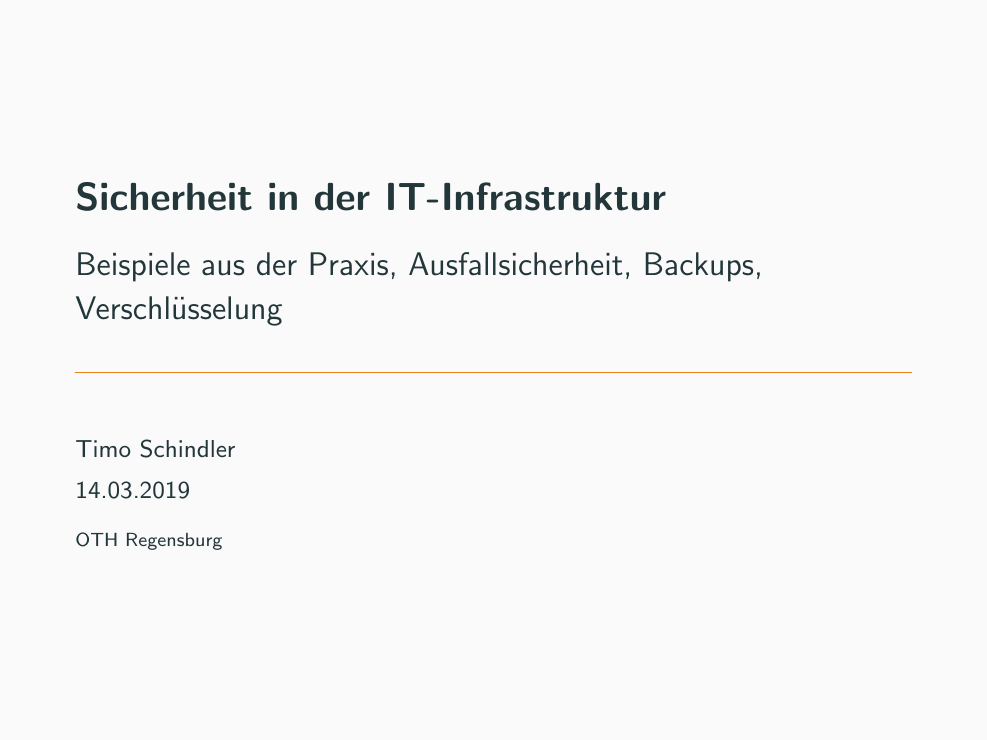

# Sicherheit in der IT-Infrastruktur - Beispiele aus der Praxis, Ausfallsicherheit, Backups, Verschlüsselung

Vortrag über Sicherheit in der IT-Infrastruktur für das Bayerische IT Security Cluster in Kehlheim. Zielsetzung ist die Einführung anhand einfacher Beispielen in Ausfallsicherheitskonzepten, Backups und Verschlüsselung. Zielpublikum: IT-Admins und Unbedarfte.

## Lizenz und Copyright

Der Inhalt dieser Präsentation steht unter [CC-BY-NC-SA 4.0](https://creativecommons.org/licenses/by-nc-sa/4.0) - [Timo Schindler](https://www.timoschindler.de). Dies beinhaltet auch alle Bilder ohne Quellenangabe (selbst erstellt). Bitte beachten Sie die jeweilige Lizenz der Bilder mit Quellenangabe.
